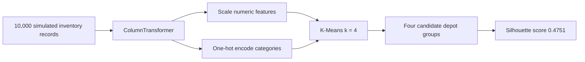

# Autonomous Industrial Vehicle: ML Product Grouping

final project of a machine-learning project for an autonomous vehicle operating in an industrial plant. The vehicle's project workflow task is to group inventory into four physical destination depots using unsupervised learning.

## Problem and approach

The generated inventory contains **10,000 records** with mixed product attributes. Since the facility has four depots, the project applies **K-Means with k = 4** after scaling numerical features and one-hot encoding categorical features.



## Report findings

| Cluster / depot | Interpretation in the report | Mean product weight |
|---|---|---:|
| Depot 0 | Ambient products, medium-to-heavy | 63.14 kg |
| Depot 1 | Refrigerated products | 38.43 kg |
| Depot 2 | Ambient products, lightest group | 13.63 kg |
| Depot 3 | Ambient products, heaviest group | 87.97 kg |

The report records a **silhouette score of 0.4751**, interpreted there as moderate separation. The cluster numbers are model labels, not an inherent ordering; the depot interpretations come from post-hoc analysis of the generated data.

## Core competencies

- Unsupervised machine learning and K-Means clustering
- Mixed-type tabular preprocessing with scikit-learn `ColumnTransformer`
- Numerical feature scaling and categorical one-hot encoding
- Cluster profiling and silhouette-based evaluation
- Translating model groups into logistics interpretations
- MLOps architecture planning for deployment and drift monitoring

## Tools and libraries

**Python**, **Pandas**, **NumPy**, **scikit-learn**, **Matplotlib**, **Seaborn**. The report also proposes IBM Watson Studio, Watson Machine Learning, and Watson OpenScale as an MLOps path; the repository does not claim a production deployment.

## Repository code

`src/cluster_products.py` contains the Python cells exported from the project workflow notebook. Configure a permitted input dataset path before running.

## Setup

```bash
python -m pip install -r requirements.txt
```

## Limitations

The inventory is simulated, and the four-depot interpretation depends on the report's generated dataset. A production routing system would require validation with real operating constraints, safety checks, and human oversight. Data and cloud credentials are not included.
